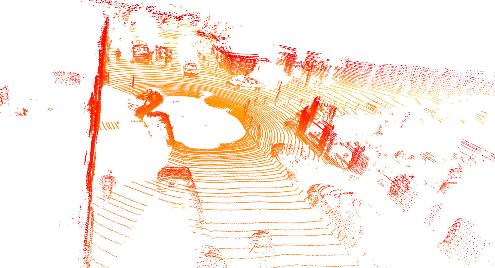
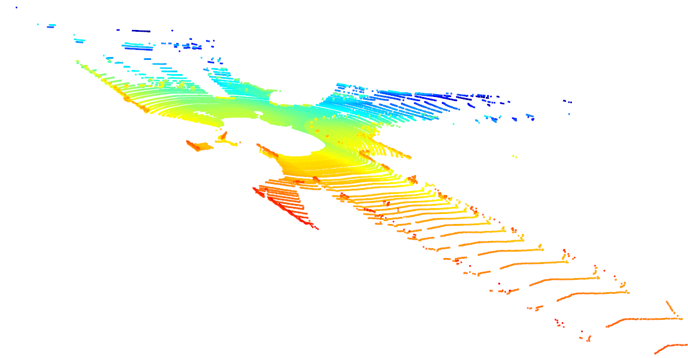
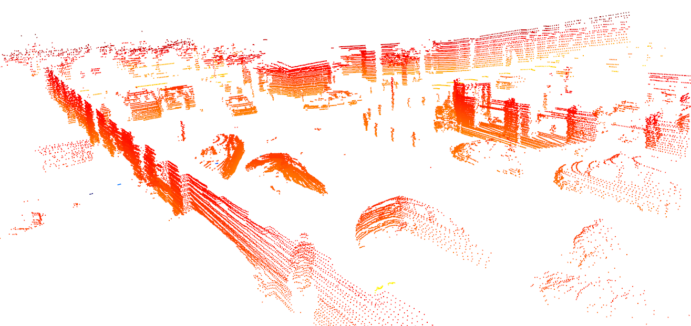
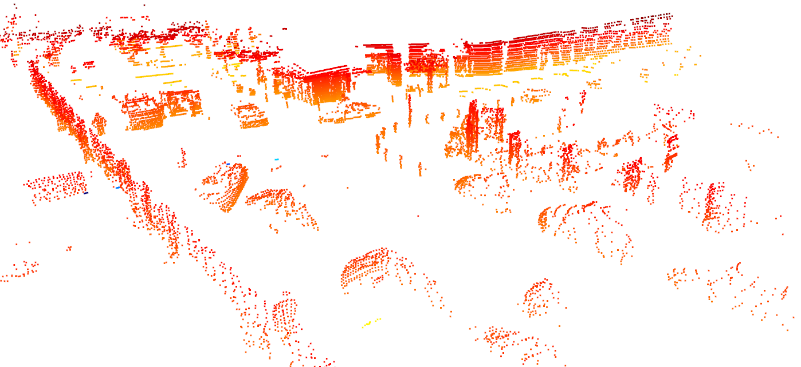

# 3D-Point-Cloud-Algorithm

> Author: Zhen Tan (MagicTZ)
> 
> Version: 0.0.1

## 项目描述 (Description)

该项目基于深蓝学院三维点云处理的课后作业, 不仅对其中重要的公式进行了详细的推导,并且编程分别单独实现了三维点云的各个关键组成部分

## 内容列表 (Content of table)

- [ch1 -  PCA分析与体素滤波](https://github.com/MagicTZ/3D-Point-Cloud-Algorithm_tz/tree/master/ch1_basic/01_Introduction/src)

- [ch2 - kdtree, octree, and search algorithms](https://github.com/MagicTZ/3D-Point-Cloud-Algorithm_tz/tree/master/ch2_tree/src)

- [ch3 - Clustering Algorithms: K-Means, GMM, Spectral Clustering](https://github.com/MagicTZ/3D-Point-Cloud-Algorithm_tz/tree/master/ch3_EM/src)

- [ch4 - Extracting non-ground points by RANSAC and clustering by DBSCAN](https://github.com/MagicTZ/3D-Point-Cloud-Algorithm_tz/tree/master/ch4_modelfitting/src)

- [ch5 - PointNet: 待上传](https://github.com/MagicTZ/3D-Point-Cloud-Algorithm_tz/tree/master/ch5_dl/doc)

## 事例 (Examples)

事例分别展现了在不同章节实现的结果, [具体代码](#内容列表-content-of-table)请进入各章节文件夹进行查看.

- [提取地面点并对非地面点聚类](https://github.com/MagicTZ/Visual-Slam-Algorithms/tree/master/ch4-disparity%2Ccamera_model%2CGN/src/undistorted)

   
  

图片的先后顺序分别为1.原始点云 2.地面点(RANSAC) 3.非地面点 4.采样后非地面点 5.聚类结果(DASCAN)

---
## 维护者
[@MagicTZ](https://github.com/MagicTZ)